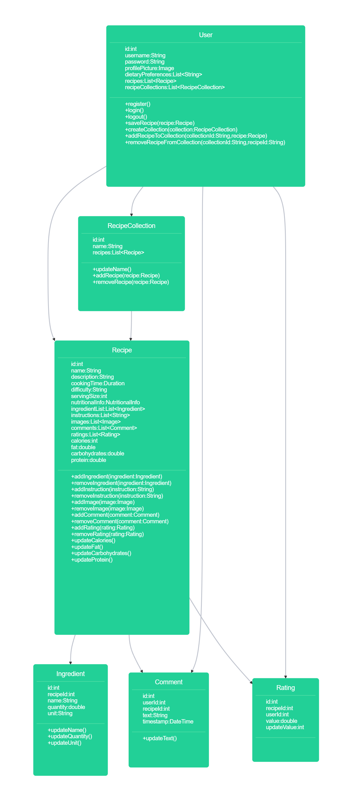
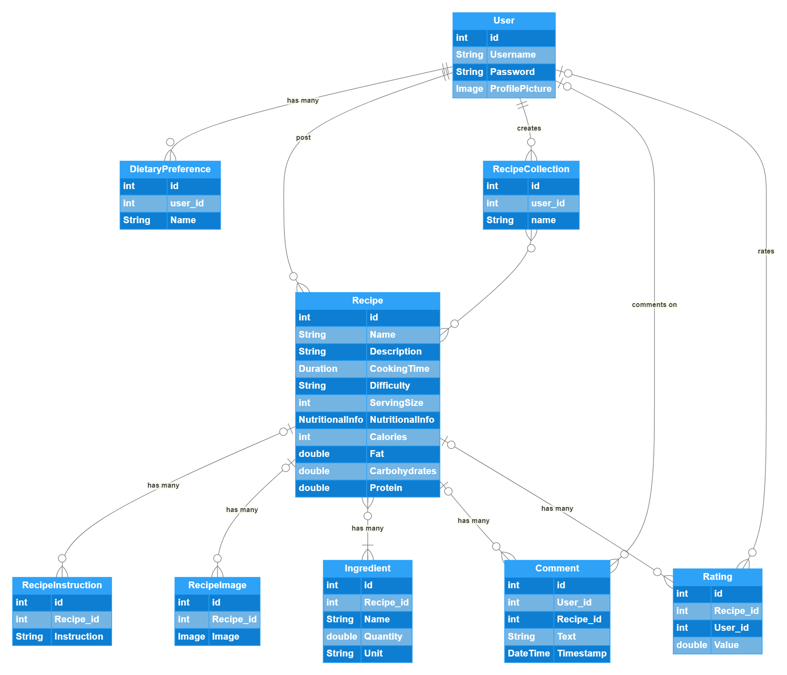

# Food Recipe App

The Food Recipe App is an application that allows users to discover, save, and share various food recipes.
It provides a platform for users to explore a wide range of recipes,
access detailed instructions and ingredient lists, and create personalized recipe collections.

## user stories
As a user, I want to be able to register an account with my username and password so that I can have a personalized experience in the app.

As a user, I want to be able to log in securely with my credentials so that I can access my saved recipe collections.

As a user, I want to be able to browse and search for recipes based on different criteria such as cuisine type, dietary preferences, or meal courses.

As a user, I want to be able to view detailed information about a recipe, including the name, description, cooking time, difficulty level, serving size, nutritional information, ingredient list, instructions, images, comments, and ratings.

As a user, I want to be able to create personalized recipe collections, such as "Breakfast Ideas" or "Vegetarian Dishes" and add or remove recipes from those collections.

As a user, I want to be able to add notes or ratings to recipes based on my experiences or modifications.

As a user, I want to be able to share recipes.

As a user, I want to be able to leave comments or ratings on recipes to engage with the community and provide valuable input.

As a user, I want to be able to apply dietary filters to customize recipe suggestions based on my preferences or dietary restrictions.

As a user, I want to be able to set timers within the app to track cooking or baking times.

As a user, I want to be able to switch between different measurement systems (e.g., metric and imperial) for recipe quantities.

### Class diagram

### ER diagram

